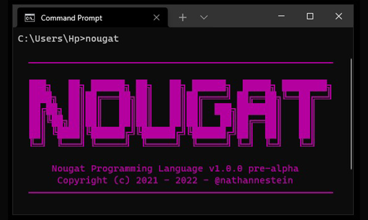

# Nougat Programming Language
A dynamic scripting language.



## About the Language
Nougat programming language is a general-purpose dynamic scripting and programming language. Nougat is a high-level language and is compiled just-in-time. This programming language is specially designed for coding dynamicism.

Strictly designed with so much powerful expressiveness in writing programs and/or code, Nougat is also designed for amateurs. With little complexity, oneself can learn Nougat easily.

## Documentation
Nougat programming language is still at its infancy, which means it still lacks some features that are needed for commercial developments, such as APIs (encoding, networking, database management, I/O, etc.) However, there are already plans for Nougat's future releases. Thus, as for now, the current official version of the release is the pre-alpha, despite its poorly written documentation which was published without any proofreadings.

The documentation is located on the ```docs``` folder but also available at [https://nougat.neocities.org](https://nougat.neocities.org)

## The Development
Nougat will no longer be continued in terms of development. Starting today (11 December 2022) it will be declared as deprecated (as it was in the begining, lol).

## Important Notes
- This language must not be used in any production, unless you're a perfect idiot.
- Nougat is now deprecated and the development will be discontinued.

## License
```
Copyright © 2022 Nathanne Isip

Permission is hereby granted, free of charge, to any person obtaining a copy of this software and associated documentation files (the “Software”), to deal in the Software without restriction, including without limitation the rights to use, copy, modify, merge, publish, distribute, sublicense, and/or sell copies of the Software, and to permit persons to whom the Software is furnished to do so, subject to the following conditions:

The above copyright notice and this permission notice shall be included in all copies or substantial portions of the Software.

THE SOFTWARE IS PROVIDED “AS IS”, WITHOUT WARRANTY OF ANY KIND, EXPRESS OR IMPLIED, INCLUDING BUT NOT LIMITED TO THE WARRANTIES OF MERCHANTABILITY, FITNESS FOR A PARTICULAR PURPOSE AND NONINFRINGEMENT. IN NO EVENT SHALL THE AUTHORS OR COPYRIGHT HOLDERS BE LIABLE FOR ANY CLAIM, DAMAGES OR OTHER LIABILITY, WHETHER IN AN ACTION OF CONTRACT, TORT OR OTHERWISE, ARISING FROM, OUT OF OR IN CONNECTION WITH THE SOFTWARE OR THE USE OR OTHER DEALINGS IN THE SOFTWARE.
```